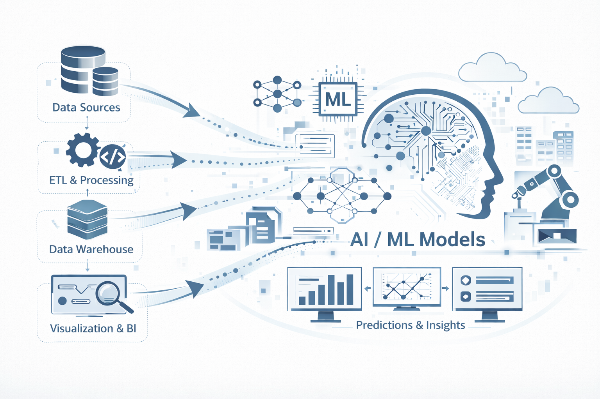

## 1. Data Governance
A good data engineer knows that data is not just a collection of items, but it is a critical asset that should be governed with proper policies and procedures.
The **Data Governance** team plays a crucial role in ensuring data quality, consistency, security, and compliance. Data governance is a comprehensive approach
that comprises the principles, practices and tools to manage an organization’s data assets throughout their lifecycle. By aligning data-related requirements with
business strategy, data governance provides superior data management, quality, visibility, security and compliance capabilities across the organization.
Implementing an effective data governance strategy allows companies to make data easily available for data-driven decision-making while safeguarding their data
from unauthorized access, and ensuring compliance with regulatory requirements.[1](#references)
You can read more about data governance [here](https://www.databricks.com/discover/data-governance).

## 2. Data formats
Data formats define how data is structured and encoded, while data serialization is the process of converting in-memory data into those formats for storage or transmission. Serialization depends on data formats.
Serialization is to converting in-memory objects / data structures into a sequence of bytes so they can be:Sent over a network (APIs, messaging);Saved to disk (files, databases);Shared between systems And later deserialized back into usable objects.

#### Row-Major Versus Column-Major Format

CSV (Comma-separated values) is row-major, which means consecutive elements in a row are stored next to each other in memory. Parquet is column-major, which means consecutive elements in a column are stored next to each other. Row-major formats are better when you have to do a lot of writes, whereas column-major ones are better when you have to do a lot of column-based reads.[2](#references)

#### Text Versus Binary Format

CSV and JSON are text files, whereas Parquet files are binary files. Text files are files that are in plain text, which means they are human-readable. Binary files are nontext files and contains onlys 0s and 1s. Binary Files are more compact.[2](#references)

AWS recommends using the Parquet format because the Parquet format is up to 2x faster to unload and consumes up to 6x less storage in Amazon s3, compared to text formats.[2](#references)

## 3. How Data Team Works
Data originates from a big company’s systems such as: Databases (Sales, Customers, Products), APIs, Applications, Logs and external tools. 
These sources continuously generate raw data which are automatically ingested into a central data system designed by the **Data Architect** and 
built by **Data Engineers**. **Data Architect** can design many type of architecture for data flow however the most common architecture is **Medallion 
Architecture**:

- **Bronze**: Where raw data is first ingested from sources like APIs and Sales databases.
- **Silver**: Where data is cleaned and filtered.
- **Gold**: Where data is modeled and optimized for business use.   

Once the blueprint exists, the **Data Engineer** steps in to build the actual machinery.

- **Automated Pipelines**: Engineers build the "pipelines"—automated systems that move data from various sources (Databases, Apps, APIs) into the data system.
- **Maintenance**: They ensure these pipelines run reliably, often updating daily so that the data remains fresh for the rest of the team.

With the "Gold" layer of data ready, the **Data Analyst** acts as the primary bridge to the business stakeholders.
Data Analysts run SQL queries and one-time analyses to understand what happened and why. When a report is needed 
every single day, it becomes too burdensome for an analyst to do manually. This is where the **BI (Business Intelligence) 
Developer** takes over. They build automated dashboards that live on a 24/7 secure server.

  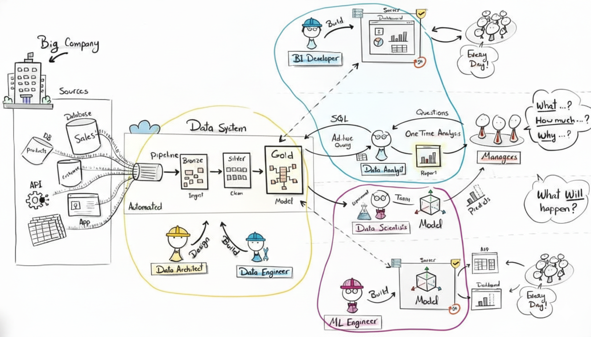
  

  Fig. A - Data flow overview. Source: 
  <a href="https://youtu.be/J2rQTJby8XM" target="_blank" rel="noopener noreferrer">
    Data with Baraa
  </a>.

While analysts look at the past and present, **Data Scientists** and **ML (Machine Learning) Engineers** look forward.

- **Predictive Modeling**: Data Scientists experiment with the data to build models that answer questions like "What will happen?"—such as predicting which customers might leave (churn).
- **Productionalizing AI**: The ML Engineer then builds the infrastructure to deploy these models into live applications, ensuring the predictions work at scale, every day.

## 4. Data Architect
A Data Architect is a senior data professional responsible for designing, structuring, and managing an organization’s data ecosystem so that data is reliable, scalable, secure, and easy to use for analytics and applications.

#### What a Data Architect does

- Designs data models (conceptual, logical, physical)

- Defines data architecture for databases, data warehouses, data lakes, and lakehouses

- Chooses appropriate data technologies (SQL/NoSQL databases, cloud data services)

- Sets data standards, policies, and governance rules

- Ensures data governance

- Works closely with data engineers, analysts, data scientists, and business teams

- Plans how data flows from source systems → storage → analytics

Without a data warehouse, processes are manual, error-prone, slow, and inconsistent.
With a data warehouse, ETL automates the flow to a single source of truth, making it faster, scalable, and capable of maintaining historical data.

#### Data Modeling
The data architect creates the blueprints for scalable data systems, including data modeling to ensure structure, efficiency, and alignment with business needs.
If the data warehouse is a library, Data Modeling is the sophisticated system used to categorize every book, shelf, and aisle to ensure a reader can find exactly 
what they need in seconds. It is the process of defining how data is connected and structured to reflect the reality of the business. Data modeling occurs at three 
distinct levels of abstraction, moving from high-level ideas to technical reality:

**Conceptual Level**: This focuses on identifying the main "entities" or big ideas, such as "Customers," "Orders," or "Products".

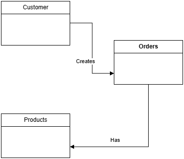

Fig. B - Conceptual Level i.e. Big picture view

**Logical Level**: This defines the "attributes" for each entity—for example, a "Customer" entity now includes a name, email, and address. In the context of the 
Gold Layer (the business-ready data), the focus is primarily on this logical design.

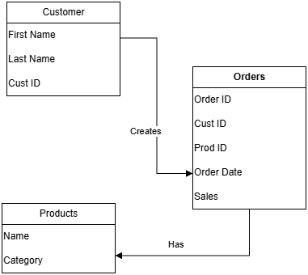

Fig. C - Logical Level i.e. Blueprint

**Physical Level**: This is the technical implementation, where the design is translated into actual database tables, data types, and storage requirements.

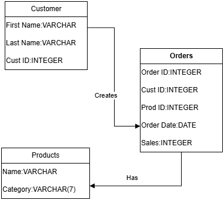

Fig. D - Physical Level i.e. Implementation

At the heart of a data model there are two types of tables that serve very different purposes:

**Fact Tables (measures)**: These act as the "heart" of the model. They store numeric "events" or measurements, such as a sale amount, a quantity of items sold, or a temperature reading.
A fact table consists of foreign keys referencing dimension tables and numeric measures, with optional degenerate dimensions. Degenerate dimensions means identifiers with no separate dimension table 
i.e. order_id, invoice_number, transaction_id etc.

**Dimension Tables (attributes)**: These provide the "context" for the facts. They contain descriptive information—the "who, what, where, and when." For example, if a Fact Table shows a sale 
of $50, the Dimension Table tells you it was bought by "John Doe" at "Store #4" on "Tuesday".

  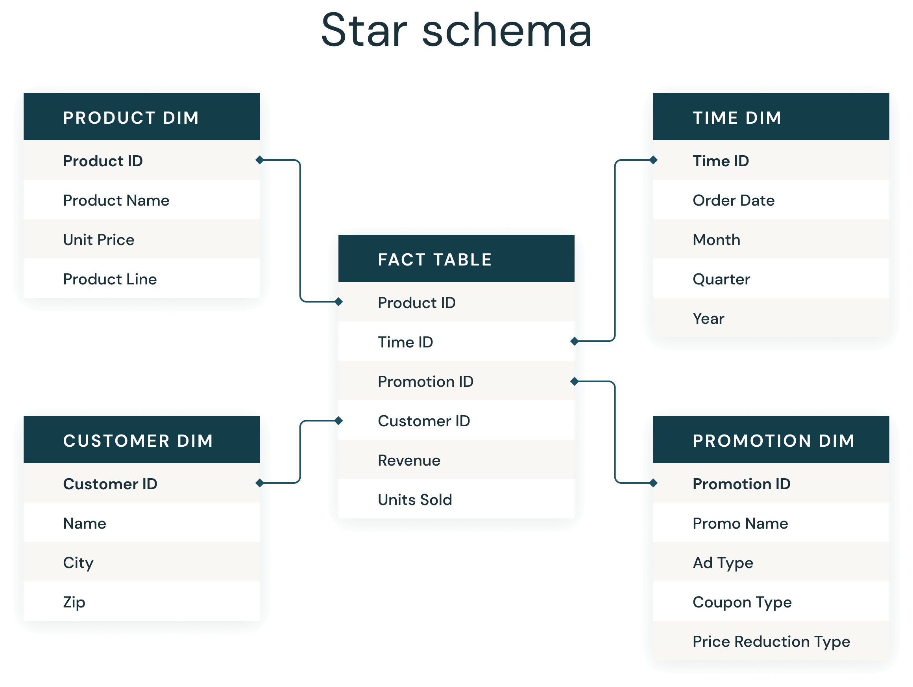
  

  Fig. E - Fact and Dimension Tables. Source: 
  <a href="https://www.databricks.com/glossary/star-schema" target="_blank" rel="noopener noreferrer">
    Databricks.com
  </a>.

A fact table sits at the center and connects to all dimensions. Without dimension keys, the fact table would have no context.
Hence, to relate different dimension tables to a fact table, the fact table must store the keys of those dimension tables.

The way these fact and dimension tables are linked together is called a Schema. Architects generally choose between two primary styles:

**The Star Schema**: This is the simplest and most common design. It features a central Fact Table surrounded by Dimension Tables, resembling a star. Its simplicity makes it incredibly fast for analysts to query.

**The Snowflake Schema**: This is a more complex version where dimensions are "normalized"—meaning they are broken down into sub-dimensions (like "City" branching off of "Store"). While more efficient for storage, 
it is more complex to navigate than the star schema.

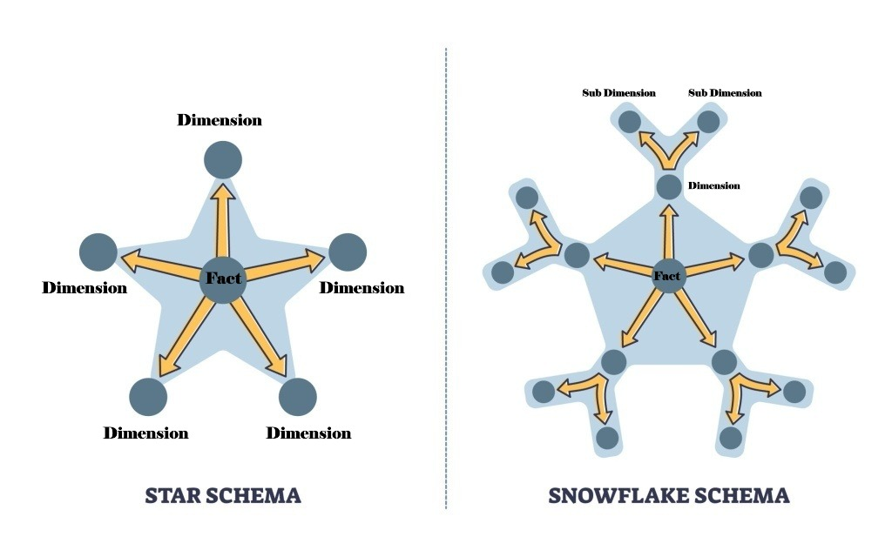

Fig. F - Schema Design

#### Bonus Tips:

when you are looking to any datasets in any projects, See the data always divided between Dimensions and Measures. Doing this will help you understand the data better and generate endless amounts of insights more effectively

  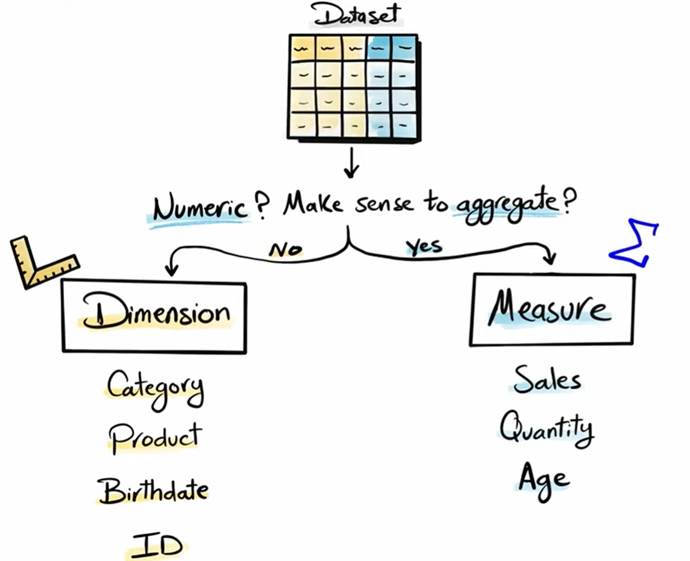
  

  Fig. G - Dimensions and Measures. Source: 
  <a href="https://youtu.be/J2rQTJby8XM" target="_blank" rel="noopener noreferrer">
    Data with Baraa
  </a>.

- Dimensions are descriptive attributes. They are non-aggregatable, meaning you cannot mathematically aggregate them together to get a meaningful insight (e.g., you wouldn't add two birth dates(i.e. 2001/04/19 and 2001/04/20) together).
Dimensions are the qualitative attributes used for grouping and segmenting data. They act as the "labels" that provide context to your numbers. Examples: Categories, names, dates, and geographic locations.

- Measures are the quantitative, aggregatable numerics that represent the actual values you want to analyze. These values are designed to be summed, averaged, or counted. Examples: Sales figures, profit totals, or the quantity of items sold.

When a data analyst creates a report, they use these two types of data in tandem:

"Show me the Sales (Measure) broken down by Category (Dimension)."

Without dimensions, a measure is just a number without context; without measures, a dimension is just a list without value.

  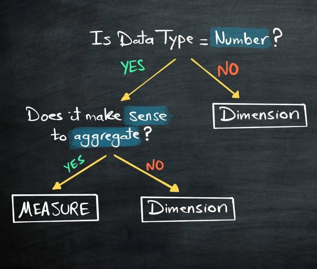
  

  Fig. H - Algorithm to find out the dimensions and measures. Source: 
  <a href="https://youtu.be/J2rQTJby8XM" target="_blank" rel="noopener noreferrer">
    Data with Baraa
  </a>.

  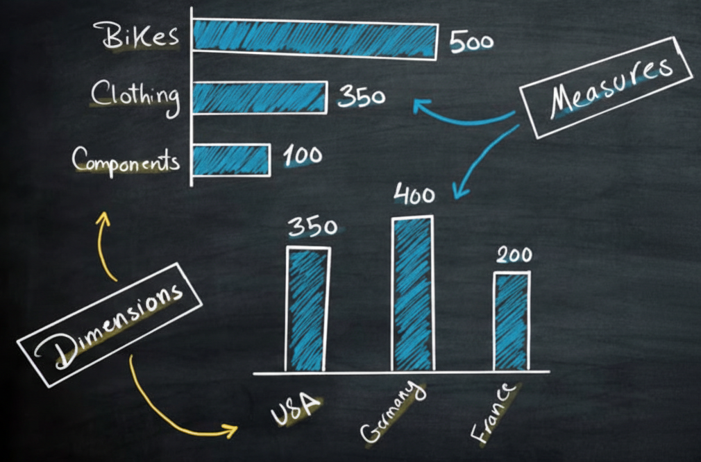
  

  Fig. I - Dimensions and Measures Example. Source: 
  <a href="https://youtu.be/J2rQTJby8XM" target="_blank" rel="noopener noreferrer">
    Data with Baraa
  </a>.

#### Data Architectures:
Architects choose from several foundational structures depending on the type of data and the business goals.

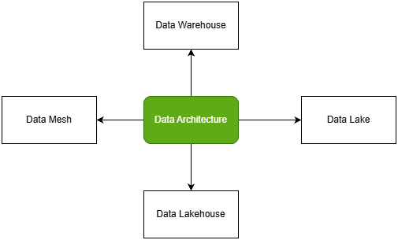

Fig. J - Data Architectures

- Data warehouse:
    A data warehouse is a data management system that stores current and historical data from multiple sources in a business-friendly manner for easier insights and reporting.
    Data warehouses are typically used for business intelligence (BI), analytics, reporting, data applications, preparing data for machine learning (ML) and data analysis.[3](#references)
- Data Lake:
    A Data Lake is a centralized large-scale storage system that holds raw data in all formats (structured, semi-structured, unstructured).
    It is used for Machine learning, Big data analytics and Log, IoT, image, and video storage. For eg : AWS S3, Google Cloud Storage, Azure Blob Storage, Hadoop HDFS.

- Data Lakehouse:
    A Data Lakehouse combines the flexibility of a Data Lake with the performance and reliability of a Data Warehouse.
    For eg : Databricks + Delta Lake, Apache Iceberg, Apache Hudi.

- Data Mesh:
    Data Mesh is not a storage technology, but an organizational and architectural approach to managing data at scale.
    It is a decentralized approach to data management where data is owned and governed by its users, 
    rather than by a central data team.
    For eg : Finance team owns finance data, HR team owns HR data, Marketing team owns marketing data

#### Data Warehouse Design Approaches:  
  The architect must decide how data flows through the system. Several famous methodologies exist, each with a different philosophy on speed and structure:

  1. Inmon’s Method: A top-down approach where data moves from a staging area to a centralized enterprise warehouse, and finally into smaller "data marts(a smaller, focused version of a data warehouse)" for specific departments.

  2. Kimball’s Approach: A faster, bottom-up method that focuses on getting data directly into "marts" for immediate use.

  3. Data Vault/Hybrid Approach: Combine the agility of Kimball with Inmon’s structure. Data Vault modeling separates raw, business, and presentation layers to preserve auditability and support frequent schema changes without major redesign.

  4. Medallion Architecture: Organizes data into three logical layers: Bronze (raw ingestion), Silver (cleaned and filtered), and Gold (business-ready and optimized).

## 5. Data Engineering
In the grand architecture of a data-driven organization, the Data Engineer operates in the "engine room," ensuring the fuel of information flows smoothly and reliably.
Their primary mission is to build and maintain the invisible infrastructure that supports every insight and prediction. The role of data engineers is to build pipelines
for ETL (Extract, Transform, Load) processes, handling massive data volumes and automating everything to operate without manual intervention.
The process varies by layer and is not always a full ETL sequence. For example, in a Data Lake, the process is often just Extract and Load (EL), with transformation happening later.

- Extract: The engineer builds connectors to diverse sources, including databases, static files, real-time streams like Kafka, or external APIs.

- Transform: The raw data is refined by fixing data types, removing duplicates, and applying complex business logic through joins and aggregations.

- Load: Finally, the polished data is delivered into target systems, making it ready for use.

## 6. Data Analysis
Data Analysis is the systematic process of collecting, cleaning, transforming and interpreting data to discover useful information, identify patterns and support decision-making.

Data Analysis Process:

 1. Define Objectives:
Establishes the analytical scope and success criteria. Converts business questions into testable hypotheses and measurable metrics, determining what insights must be generated and what decisions the analysis will inform.

 2. Data Collection:
Aggregates raw data from relevant sources such as databases, APIs, or logs. Ensures the dataset is comprehensive, accurate, and structured appropriately for subsequent processing and analysis.

 3. Data Cleaning & Preprocessing:
Identifies and corrects errors, missing values, and outliers. Transforms and encodes data into a consistent format, creating a reliable dataset suitable for statistical methods and machine learning algorithms.

 4. Exploratory Data Analysis (EDA):
Examines data through summary statistics and visualizations to uncover patterns, correlations, and anomalies. Informs hypothesis refinement and guides selection of appropriate analytical techniques.

 5. Statistical Analysis:
Applies statistical tests, models, or algorithms to validate hypotheses, quantify relationships, and generate predictions. Transforms observations into evidence-based conclusions that address the original objectives.

 6. Visualization & Communication:
Translates analytical results into clear visual and narrative formats. Presents findings to stakeholders in an accessible manner, enabling data-driven decisions and strategic actions.

 Iterative Nature:
 The process is cyclical; insights from later stages often require revisiting earlier steps to refine questions, collect additional data, or improve data quality.

#### Types:

| Type | Focus | Question | Tools Used |
|------|-------|----------|------------|
| Descriptive | Past/Current | What happened? | Excel, SQL, BI dashboards |
| Diagnostic | Causes | Why did it happen? | Drill-down, correlation analysis |
| Predictive | Future | What will happen? | Regression, ML models, forecasting |
| Prescriptive | Action | What should we do? | Optimization, simulation, decision trees |

## 7. Data Science
While analysts look to the past to understand "What happened?", the data scientist assists in answering the vital business question: "What will happen?". 
This phase of the data journey transforms information into a predictive engine, allowing a company to anticipate challenges before they arise. The workflow of a data scientist is a rigorous process of refining information through several critical stages:

- **Data Collection & Preprocessing**: Data scientists gather massive datasets from diverse sources. They perform "data surgery"-merging complex tables, handling missing (null) values, and ensuring every piece of data is in the correct format.

- **Exploratory Data Analysis (EDA)**: Before building a model, they conduct EDA to uncover hidden patterns. This involves using visualizations to understand data distributions, identifying customer clusters, and finding correlations between variables.

- **Feature Engineering**: This is where domain expertise meets data. Scientists create new data points (columns) to give models more context, such as converting a simple "Sign-up Date" into "Days Since Sign-up" to better measure loyalty.

To create a prediction, such as the probability that a specific customer will leave (churn), a structured mathematical approach is used:

- **Splitting Data**: The dataset is divided into a Training Set (to teach the model) and a Test Set (to verify its accuracy).

- **Algorithm Selection**: Choosing the right mathematical steps to learn patterns from the data.

- **Training**: The model is trained to minimize errors, refining its logic until its predictions match reality as closely as possible.

- **Prediction**: The final model generates actionable scores, such as a "Churn Probability Score" for every client.

## 8. Machine Learning Engineer

#### What they do?

Data Scientists | ML Engineers | AI Engineers
|----------------|----------------|----------------|
Insights | Building Production-Ready ML Systems | LLMs, Agents
Experiments, ML modeling | Engineered ML Systems | Integrating MCP(Model Context Protocol)
Business thinking | Pipelines, MLOps | Building AI Features into products, Doing Retrieval Augmented Generation(RAG)

#### What they need?

Data Scientists | ML Engineers | AI Engineers
|----------------|----------------|----------------|
SQL/Python, dashboards(Tableau, PowerBI), Analysis | Build and Deploy Models |LLMs, Agents, Vector DBs, Langchain, FastAPI, MCP
A/B test, Feature work | Pipelines, MLflow, monitoring, model optimization | prompting+evaluation
Classic ML(some teams) | Docker, Cloud, CI/CD, API(FastAPI) | Fine Tuning/RAG/orchestration
Heavy Business Communication | Strong Coding Expectation | Shipping AI Features fast + product thinking

## References

1. [Data Governance|Databricks](https://www.databricks.com/discover/data-governance)
2. [Thinam Tamang blog|Data Engineering Fundamentals](https://thinamxx.github.io/blog/posts/DataEng/DataEngineering.html#batch-processing-versus-stream-processing)
3. [Data Warehouse|Databricks](https://www.databricks.com/discover/data-warehouse)
4. [Data with Bara Youtube Channel](https://www.youtube.com/@DataWithBaraa)

